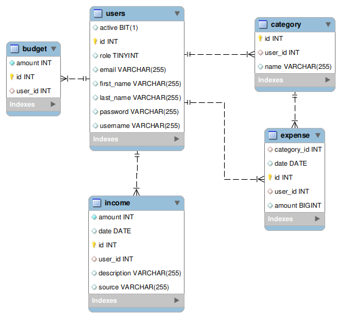

# Expense-Tracker
## Overview
This application allows user to track his expenses and income.
## Features
* **Authentication and Authorization:**
Securely create an account and login using jwt authentication
* **Expenses Entry:** Add, update, delete and categorize expenses expenses.
* **Income Entry:** Logging incomes from various sources.
* **Budget Management:** Setting budgets to track expenses across different categories
* **Expenses Tracking:** View your expenses and sort them according to date or amount
* **Incomes Tracking:** View your incomes and sort them according to date or amount
## Database Design
